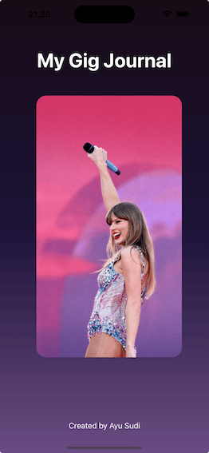
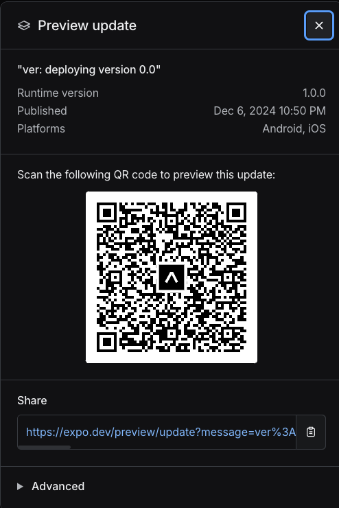

# Gig Journal

This project for test at CloudFit.

name : Ayu Sudi Dwijayanti  
email : ayusudi.abc@gmail.com

> I am using React Navigation with Stack, React Native Reanimated, and Expo Linear Gradient. I started this project after lunch at 13:00 (Jakarta Time) and finished it by 21:00. While I considered implementing a better transition between the home page and the detail page, I prioritized time constraints and focused on completing the project and creating content that I love. Overall, I enjoyed working on this homework project. Thank you for the opportunity!

Here is the page :

- Home Page & Slider Carousel  
  
  

- Detail Page  
  

## Expo

```
Branch             development
Runtime version    1.0.0
Platform           android, ios
Update group ID    d3710d74-617f-4c8c-a877-2cf934ff28ea
Android update ID  3430bc66-f27e-4bd2-bde8-dd2d2ce5efe2
iOS update ID      e03597c9-54bc-43d8-935c-8d30ee08889b
Message            ver: deploying version 0.0
Commit             dc803edd282f0b8959f12c09b8354e7c4e17ea26*
EAS Dashboard      https://expo.dev/accounts/ayusudi/projects/GigJournal/updates/d3710d74-617f-4c8c-a877-2cf934ff28ea
```


